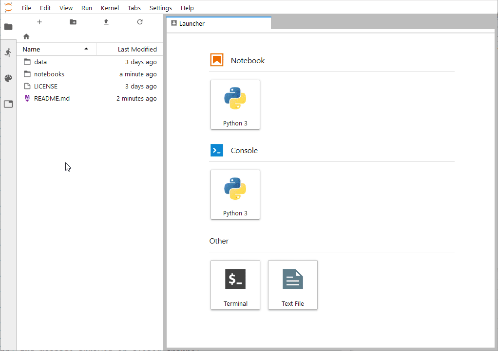
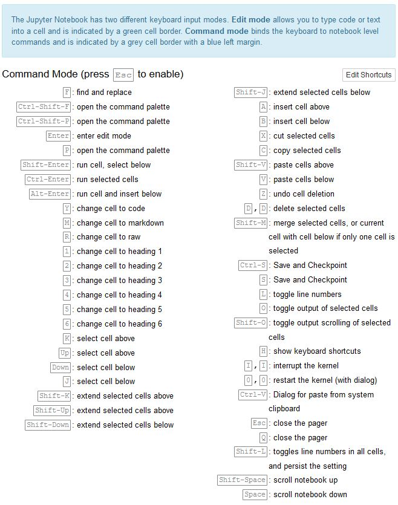

# Repository that contains files and example Jupyter notebook demonstrating PODPAC usage

To get started, make sure you have a working version of [PODPAC](https://github.com/creare-com/podpac) installed.

## Starting JupyterLab

1. Browse to the location of the `podpac_examples` repository root
2. Launch a JupyterLab session
```bash
$ jupyter lab
```

## Using JupyterLab

The official documentation can be found [here](https://jupyterlab.readthedocs.io/en/stable/user/interface.html), or from the help menu at the top of the JupyterLab browser window.

To launch an example:
* Browse to an example using the file-browser on the left panel
* Double-click the file 
* From the top menu, select `Run-->Run All`



There are multiple useful keyboard shortcuts, as shown below. For example, for evaluating cells in the notebook:
* `Ctrl-Enter`: Evaluate current cell
* `Shift-Enter`: Evaluate current cell and select the next cell
* `Alt-Enter`: Evaluate current cell and create a new cell after it



## Where to go from here

* The [Introduction](notebooks/Introduction.ipynb) notebook introduces the PODPAC library and some Python basics
* The `notebooks/basic_examples` folder contains notebooks with some basic examples
* The `notebooks/demos` folder contains notebooks with some more involved examples
* The `notebooks/developer` folder contains notebooks with technical implementation details for developers
* The `notebooks/presentations` folder contains notebooks of presentations given at various workshops, conferences, and other venues
* The `data` folder contains raw datafiles used for some of the examples.